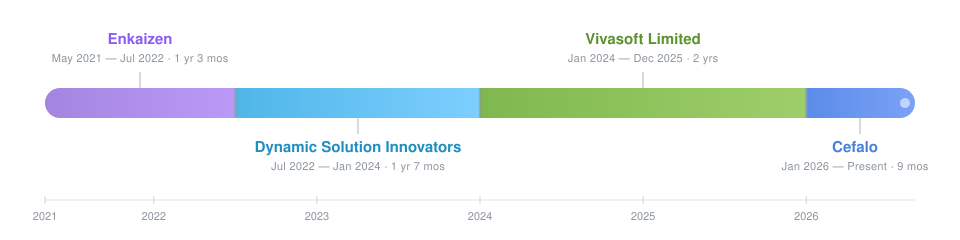

<!-- Card/stat images use a community mirror of github-readme-stats.
     The official host (github-readme-stats.vercel.app) is currently paused.
     If cards stop loading, swap the mirror host below for another one. -->

  

# Shuvo — AI-First Full-Stack Engineer

**.NET · React / Vue · Azure · Claude** — 5+ years building scalable backends and the UIs on top of them, now with an agent in the loop.
I build **with** AI and I build AI: Claude Code drives my day-to-day engineering, and I write agents from scratch to understand what's under the abstraction.
Shipped for teams in 🇮🇹 Italy · 🇺🇸 USA · 🇸🇪 Sweden · 🇮🇳 India across SaaS, enterprise tooling, and workflow automation.

&nbsp;

---

## ⚙️ Stack

&nbsp;

`ASP.NET Core` · `Entity Framework Core` · `REST` · `SQL Server` · `PostgreSQL` · `xUnit` · `TestContainers` · `Azure` · `Docker` · `GitHub Actions`

**AI toolchain** — `Claude Code` · `Claude API` · `MCP` · `agentic workflows` · `AI-assisted refactoring & test generation`

---

## 📈 Activity

  
  

  

---

## ✍️ Writing

- [**Docker-powered .NET Integration Tests with TestContainers**](https://vivasoftltd.com/docker-powered-dot-net-integration-tests-with-testcontainers/) — real dependencies, disposable containers, no shared test DB.
- [**Garbage Collector**](https://ms-dot-net.hashnode.dev/garbage-collector) — how .NET actually reclaims memory.
- [**Design a Rate Limiter**](https://core-system-d.hashnode.dev/design-a-rate-limiter) — a full system-design walkthrough.
- [**Rate Limiting**](https://core-system-d.hashnode.dev/rate-limiting) — the algorithms and their trade-offs.

---

## 💼 Experience

  

  <b>5 yrs 4 mos</b> · Currently <b>Senior Software Engineer</b> @ Cefalo

---

  Open to talking .NET internals, system design, and building with agents. 
  <a href="https://www.linkedin.com/in/shuvo806/"><b>Reach me on LinkedIn →</b></a>

